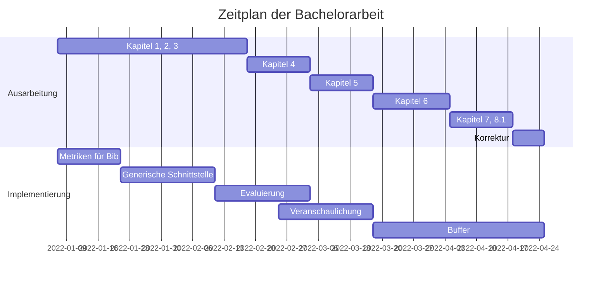

## Zeitplan

```mermaid
  gantt
      title Zeitplan der Bachelorarbeit
      dateFormat  YYYY-MM-DD
      section Ausarbeitung
      Kapitel 1, 2, 3            :a1, 2022-01-07, 42d
      Kapitel 4                  :a2, after a1 , 14d
      Kapitel 5                  :a3, after a2, 14d
      Kapitel 6                  :a4,after a3, 17d
      Kapitel 7, 8.1             :a5,after a4, 14d
      Korrektur                  :a6,after a5, 7d
      
      section Implementierung
      Metriken für Bib            :b1, 2022-01-07, 14d
      Generische Schnittstelle    :b2, after b1, 21d
      Evaluierung                 :b3, after b2, 21d
      Veranschaulichung           :b4,2022-02-25, 21d
      Buffer                      :b5,after b4, 38d
```
