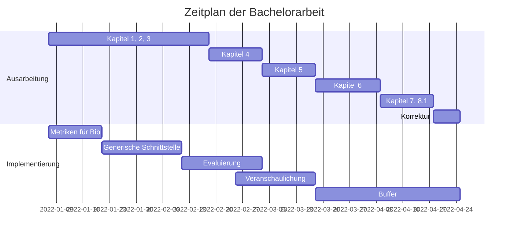

## Bachelorarbeit: Evaluation verschiedener Differential Privacy Frameworks für einen medizinischen Use-Case
In meiner Bachelorarbeit evaluierte ich mit der Betreuung von Herrn Appenzeller und Dr.-Ing. Krempel die drei Frameworks Smartnoise SDK (Microsoft), Diffprivlib (IBM) und Differential Privacy (Google) in der Privatisierung von Daten und ihrer Nutzbarkeit.
Dafür wurde eine generische Schnittstelle zur Evaluation von medizinischen Daten von mir
implementiert. Sie wird in einem medizinischen Anwendungsfall eingesetzt. Für die Evaluation
sind die Gesundheitsdaten aus der Veröffentlichung der Anzahl an COVID-19 infizierten
Menschen im Zeitraum Dezember des Jahres 2021 genutzt worden. Jedes Framework erhält
diese Daten als Eingabe und wertet sie durch eine DP Funktion aus. Aufgrund ihrer jeweiligen
Berechnungsergebnisse werden die Frameworks anhand Metriken bewertet. Sie umfassen die
Kategorien: die Einhaltung der Privatsphäre, der Genauigkeit und der Erwartungstreue.
Wenn die Werte der Metriken den Erwartungen entsprechen, können die Frameworks in den
jeweiligen Kategorien eingesetzt werden. Liefert ein Framework ungenaue oder unerwartete
Werte, so fließt dies negativ in dessen Bewertung ein.
Die gewonnen Erkenntnisse sollen über die Einsetzbarkeit der Frameworks für die Privatisierung von medizinischen Daten Aufschluss geben.

## Zeitplan

